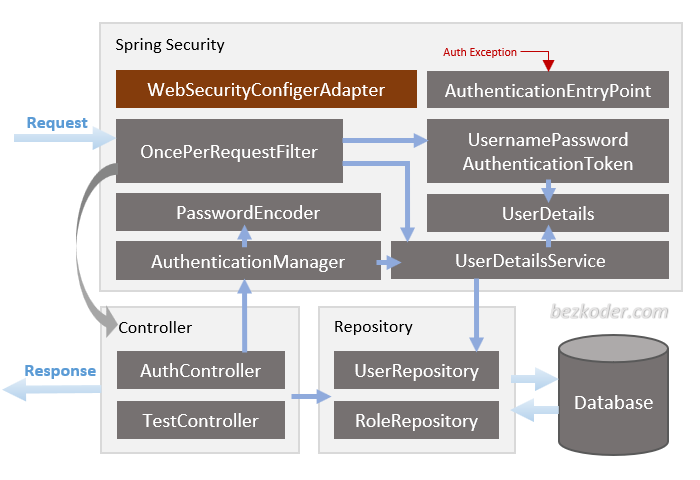

# spring-boot-security-jwt-auth-mongodb

# Spring Boot, Spring Security, MongoDB - JWT Authentication & Authorization example

- Appropriate Flow for User Signup & User Login with JWT Authentication
- Spring Boot Application Architecture with Spring Security
- How to configure Spring Security to work with JWT
- How to define Data Models and association for Authentication and Authorization
- Way to use Spring Data MongoDB to interact with MongoDB Database

## User Registration, Login and Authorization process.


## Spring Boot Rest API Architecture with Spring Security

You can have an overview of our Spring Boot Server with the diagram below:


## Run Spring Boot application

```
mvn clean spring-boot:run
```

### Image Screenshot

Auth Flow


Architecture

